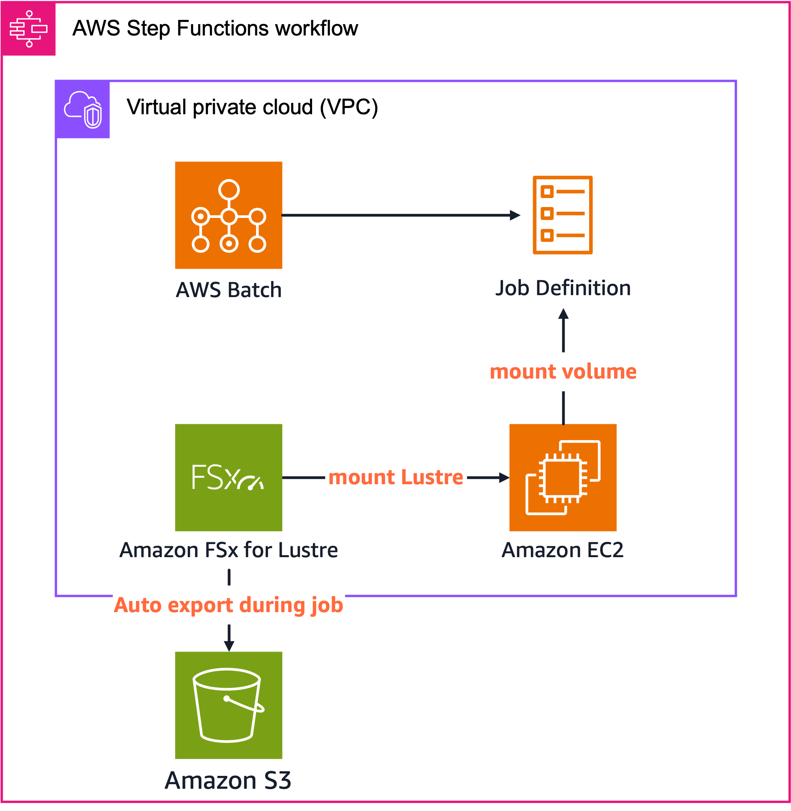
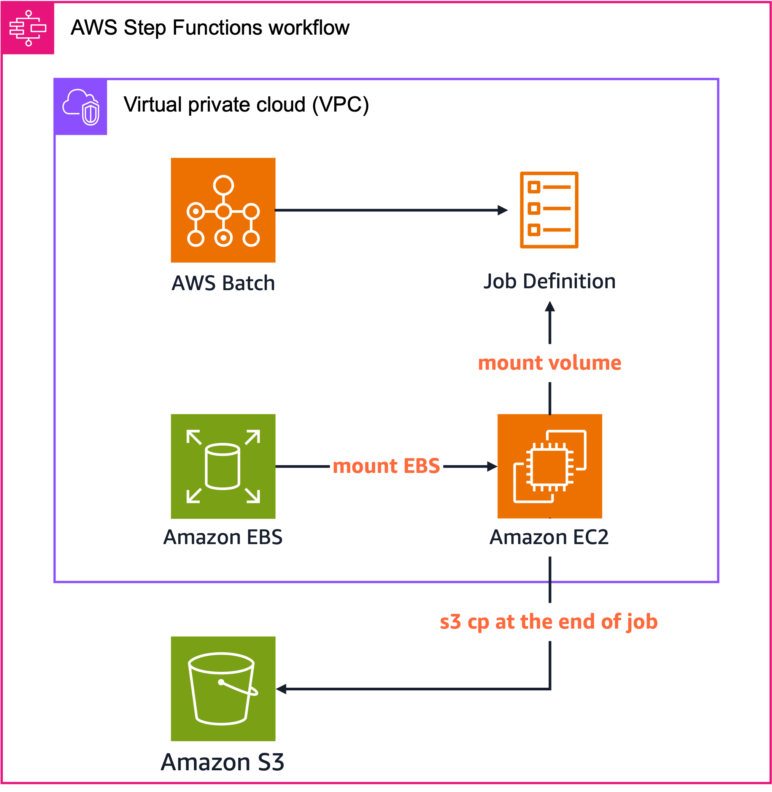

# Batch with Lustre/EBS

このプロジェクトは、AWS BatchとAmazon FSx for LustreまたはAmazon EBSを組み合わせた高性能データ処理インフラストラクチャをAWS CDKを使用してデプロイするためのものです。SPOTインスタンスを活用してコスト効率良く大規模な計算処理を実行するためのフレームワークを提供します。

## 概要

大規模なデータ処理ワークロードを効率的に実行するためのインフラストラクチャを提供します。AWS BatchのジョブスケジューリングとSPOTインスタンスの低コストを組み合わせ、ストレージオプションとして高性能な共有ファイルシステムであるAmazon FSx for Lustreと、シンプルなブロックストレージであるAmazon EBSの2つを選択できます。

### AWS BatchとSPOTインスタンスの活用

このプロジェクトは以下の利点を提供します：

- **コスト効率**: SPOTインスタンスを利用することで、オンデマンドインスタンスと比較して最大90%のコスト削減が可能
- **スケーラビリティ**: AWS Batchの自動スケーリング機能により、必要に応じてリソースを動的に調整
- **効率的なリソース管理**: AWS Batchによる効率的な計算リソースのプロビジョニングとジョブスケジューリング
- **自動化されたワークフロー**: Step Functionsによるストレージのプロビジョニングから削除までの完全自動化

### SPOTインスタンス利用時の課題と対策

SPOTインスタンスは中断される可能性があるため、以下の点を考慮する必要があります：

- **短時間ジョブ**: 短時間で完了するジョブはSPOTインスタンスの中断リスクが低い
- **リトライ機能**: AWS Batchのリトライ機能により、中断されたジョブを自動的に再開
- **チェックポイント**: 長時間実行ジョブでは定期的なチェックポイントファイルの作成が重要

チェックポイントファイルの保存先として、S3、EFS、FSx for Lustre、EBSなど様々なオプションがありますが、それぞれに特性があります：

- **Amazon S3**:
  - 高い耐久性と可用性
  - 低コストなストレージ
  - ただし、他のファイルシステムと比較してスループットが低く、I/O集約型ワークロードには適さない場合がある

- **Amazon EFS**:
  - 複数のインスタンスから同時アクセス可能
  - 自動的にスケーリング
  - 中程度のスループットとパフォーマンス

- **FSx for Lustre**:
  - 高性能な並列ファイルシステム
  - 高スループットと低レイテンシ
  - 大規模なデータセットや高性能コンピューティングに最適
  - S3との統合機能

- **Amazon EBS**:
  - シングルノードジョブに最適
  - 高いI/Oパフォーマンス
  - コスト効率が良い
  - 単一のEC2インスタンスにのみアタッチ可能

このプロジェクトでは、複数ノードによるジョブで使われるFSx for Lustreと、シングルノードジョブ向けのEBSに焦点を当てています。AWS BatchでEFSを利用する方法については、[AWSのドキュメント](https://docs.aws.amazon.com/ja_jp/batch/latest/userguide/efs-volumes.html)を参照してください。

## アーキテクチャ

このプロジェクトは、AWS BatchとAmazon FSx for Lustre/EBSを組み合わせた3つの異なるアーキテクチャモードを提供します。各モードは特定のユースケースに最適化されており、ワークロードの特性に応じて選択できます。

### Auto Export モード



Auto Export モードでは、FSx for Lustreファイルシステム上での変更が自動的にS3バケットに反映されます。リアルタイムデータ処理や継続的なデータ生成シナリオに最適です。CloudWatchメトリクスを監視してエクスポート完了を確認し、すべてのデータがS3に同期された後にリソースをクリーンアップします。

### Task Export モード


Task Export モードでは、ジョブ完了後に明示的なデータリポジトリタスクを実行してS3へのエクスポートを行います。バッチ処理や大規模データセットの処理に最適で、ジョブ実行中のエクスポートによるオーバーヘッドを避けることができます。

### Only EBS モード



Only EBS モードでは、高性能なEBSボリュームを使用してシングルノードでの処理を最適化します。共有ファイルシステムが不要な場合や、コスト効率を重視する場合に適しています。S3との連携も可能ですが、手動またはスクリプトを通じて行う必要があります。

### 共通コンポーネント
- **AWS Batch**: コンピューティングリソースの管理とジョブの実行
- **AWS Step Functions**: ワークフローの調整と管理
- **Amazon S3**: データの永続的な保存と共有
- **Amazon ECR**: コンテナイメージの保存
- **AWS Secrets Manager**: 設定パラメータの安全な管理

### ストレージオプション
1. **FSx for Lustre**
   - 高性能な共有ファイルシステム
   - S3との自動インポート/エクスポート機能
   - 2つのエクスポートモード:
     - Auto Export: 変更を自動的にS3にエクスポート
     - Task Export: 明示的なエクスポートタスクを実行
   - 複数インスタンスからの同時アクセスが可能
   - 高スループットと低レイテンシを実現

2. **EBS (Elastic Block Store)**
   - シンプルなブロックストレージ
   - 単一のEC2インスタンスにアタッチ
   - 高いIOPSとスループットを提供
   - コスト効率の良いストレージオプション
   - S3との連携オプション

## デプロイモード

このプロジェクトは3つのデプロイモードをサポートしています：

1. **autoExport**: FSx for Lustreを使用し、変更を自動的にS3にエクスポート ([詳細](docs/auto_export_mode.md))
2. **taskExport**: FSx for Lustreを使用し、明示的なエクスポートタスクを実行 ([詳細](docs/task_export_mode.md))
3. **onlyEBS**: EBSボリュームのみを使用 ([詳細](docs/only_ebs_mode.md))

各モードの詳細な説明とパラメータについては、リンク先のドキュメントを参照してください。

## 前提条件

- AWS CLI
- Node.js 14.x以上
- AWS CDK 2.x
- Docker

## セットアップ

1. リポジトリをクローン
```
git clone https://github.com/yourusername/batch-with-lustre.git
cd batch-with-lustre
```

2. 依存関係をインストール
```
npm install
```

3. CDKをブートストラップ（初回のみ）
```
npx cdk bootstrap
```

4. Dockerイメージをビルドしてプッシュ
```
cd docker
./push-image.sh
```

## デプロイ

デプロイモードを指定してCDKスタックをデプロイします：

### FSx for Lustre (Auto Export)
```
npx cdk deploy -c type=autoExport
```

### FSx for Lustre (Task Export)
```
npx cdk deploy -c type=taskExport
```

### EBSのみ
```
npx cdk deploy -c type=onlyEBS
```

## カスタマイズ

`cdk.json`ファイルの`context`セクションで各デプロイモードのパラメータをカスタマイズできます：

- **FSx for Lustre**:
  - `lustreStorageCapacity`: ストレージ容量（GB）
  - `lustreFileSystemTypeVersion`: Lustreバージョン
  - `computeEnvironmentType`: コンピューティング環境タイプ（SPOT/EC2）
  - `jobDefinitionVcpus`: ジョブあたりのvCPU数
  - `jobDefinitionMemory`: ジョブあたりのメモリ（MB）

- **EBS**:
  - `ebsSizeGb`: EBSボリュームサイズ（GB）
  - `ebsIOPS`: EBSのIOPS
  - `ebsThroughput`: EBSのスループット（MB/s）

## テストスクリプト

このプロジェクトには、ストレージパフォーマンスをテストするためのスクリプトが含まれています：

### FSx for Lustre
```
docker/lustre/write_delete_test_lustre.sh
```

### EBS
```
docker/ebs/write_delete_test_ebs_v2.sh
docker/ebs/write_delete_test_ebs_with_s3.sh
docker/ebs/write_delete_test_ebs_with_s3_sync.sh
```

これらのスクリプトは、指定されたサイズのファイルを書き込み、削除するベンチマークを実行します。

## Step Functionsによるオーケストレーション

このプロジェクトでは、AWS Step Functionsを使用して以下のワークフローを自動化しています：

1. **ストレージの作成**: FSx for LustreファイルシステムまたはEBSボリュームを作成
2. **Batchジョブの実行**: 作成したストレージを使用してBatchジョブを実行
3. **結果の保存**: 処理結果をS3に保存（自動または明示的なエクスポート）
4. **ストレージの削除**: ジョブ完了後にストレージリソースを削除（オプション）

この自動化により、以下のメリットが得られます：

- **コスト最適化**: ジョブ実行中のみストレージリソースを確保し、不要になったら自動的に削除
- **運用負荷の軽減**: 手動でのリソース管理が不要
- **再現性**: 一貫したワークフローの実行
- **エラーハンドリング**: 自動的なエラー検出と対応

SPOTインスタンスを効率的に活用するためには、一時的なデータストアとしてLustreやEBSを利用し、最終的な結果はS3などのコスト効率の良いストレージに保存することが重要です。このプロジェクトのStep Functionsワークフローはこのベストプラクティスを実装しています。

## モニタリング

FSx for Lustreの自動エクスポートモードでは、CloudWatchメトリクスを使用してエクスポートキューの状態をモニタリングします。メトリクスが特定の条件を満たすと、Step Functionsワークフローが自動的にLustreファイルシステムを削除します。

## クリーンアップ

リソースを削除するには：

```
npx cdk destroy -c type=<デプロイモード>
```

## ライセンス

このプロジェクトは[MITライセンス](LICENSE)の下で公開されています。
