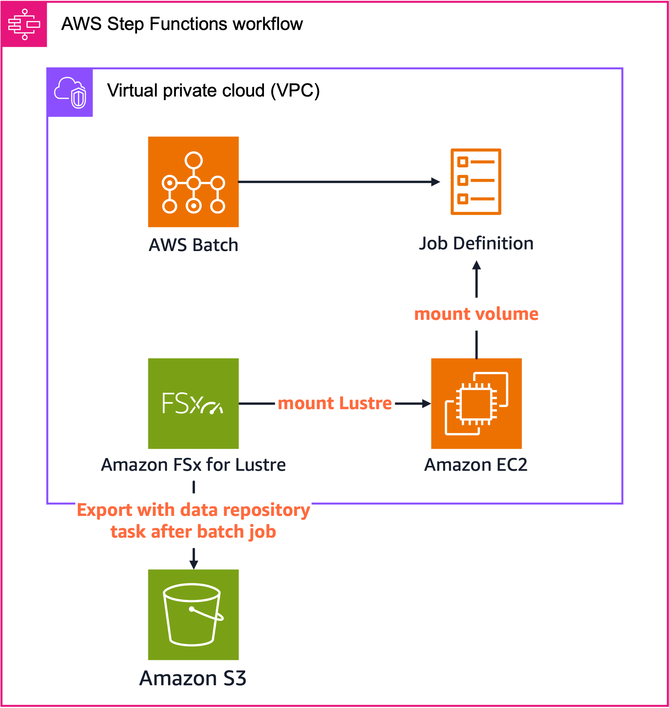

# Batch with Lustre/EBS

このプロジェクトは、AWS BatchとAmazon FSx for LustreまたはAmazon EBSを組み合わせた高性能データ処理インフラストラクチャをAWS CDKを使用してデプロイするためのものです。SPOTインスタンスを活用してコスト効率良く大規模な計算処理を実行するためのフレームワークを提供します。

## 概要

大規模なデータ処理ワークロードを効率的に実行するためのインフラストラクチャを提供します。AWS BatchのジョブスケジューリングとSPOTインスタンスの低コストを組み合わせ、ストレージオプションとして高性能な共有ファイルシステムであるAmazon FSx for Lustreと、シンプルなブロックストレージであるAmazon EBSの2つを選択できます。

### AWS BatchとSPOTインスタンスの活用

AWS Batchは効率的な計算リソースのプロビジョニングとジョブスケジューリング機能を提供し、大規模計算にも対応可能なスケーラビリティを備えています。これにSPOTインスタンスの大幅なコスト削減効果を組み合わせることで、このプロジェクトは研究開発やビジネスを加速させる強力な基盤を提供します。SPOTインスタンスを利用することでオンデマンドインスタンスと比較して最大90%のコスト削減が可能となり、AWS Batchの自動スケーリング機能により必要に応じてリソースを動的に調整できます。さらに、Step Functionsによりストレージのプロビジョニングから削除までを自動化し、運用負荷を大幅に軽減します。

### SPOTインスタンス利用時の課題と対策

SPOTインスタンスは優れたコスト効率を提供する一方で、中断が発生するリスクがあります。短時間で処理が完了するジョブや、AWS Batchのリトライ機能の範囲内で対応できるジョブであれば、このリスクは最小限に抑えられます。SPOTインスタンスは中断通知を受け取ってから2分間の猶予があるため、この時間内にチェックポイントファイルを作成できれば処理を効率的に再開できます。

しかし、長時間の処理を要するジョブや、チェックポイントファイルのサイズが大きく2分以内に作成できないケースも存在します。このような場合は、定期的にチェックポイントファイルを作成する戦略が必要になります。チェックポイントファイルの保存先として、S3、EFS、FSx for Lustre、EBSなど様々なオプションがありますが、それぞれに特性があります。

### ストレージオプションの比較

**Amazon S3**は高い耐久性と可用性を持ち、低コストでデータを保存できる優れたサービスです。しかし、一般的に他のファイルシステムと比較してスループットが低くなるため、I/O集約型ワークロードでは計算リソースがストレージの待ち時間で無駄になる可能性があります。

**Amazon EFS**は複数のインスタンスから同時アクセスが可能で、自動的にスケーリングする柔軟性を持っています。サーバーレスで伸縮自在なファイルストレージを提供するため、多様なワークロードに対応できます。

**Amazon FSx for Lustre**は高性能な並列ファイルシステムで、高スループットと低レイテンシを実現します。大規模なデータセットや高性能コンピューティングに最適であり、S3との統合機能も備えています。複数ノードからの並列アクセスが必要な場合に特に威力を発揮します。

**Amazon EBS**はシングルノードジョブに最適で、高いI/Oパフォーマンスを提供しながらコスト効率も良好です。ただし、単一のEC2インスタンスにのみアタッチ可能という制約があります (io1, io2 は[マルチアタッチ](https://docs.aws.amazon.com/ja_jp/ebs/latest/userguide/ebs-volumes-multi.html)が可能です)。シングルノードのジョブであれば、Lustreなどのリッチなファイルシステムではなく、EBSを外からマウントする形で管理する方がコスト効率が良いケースが多いと考えられます。

このプロジェクトでは、複数ノードによるジョブで使われるFSx for Lustreと、シングルノードジョブ向けのEBSに焦点を当てています。AWS BatchでEFSを利用する方法については、[AWS Batch のユーザーガイド](https://docs.aws.amazon.com/ja_jp/batch/latest/userguide/efs-volumes.html)を参照してください。

### コスト効率を最大化するアプローチ

SPOTインスタンスを活用してコスト効率を最大化するためには、LustreやEBSを一時的なデータストアとして利用し、最終的な結果はS3などのストレージコストが安いサービスに保存することが重要です。そのためには、Batchジョブの実行中だけストレージリソースを確保し、ジョブ完了後に不要になったリソースを自動的に削除する仕組みが必要です。

このプロジェクトでは、ストレージの作成からBatchジョブの実行、結果のS3への保存、そしてストレージの削除までの一連の処理をStep Functionsでオーケストレーションしています。これにより、簡単かつコスト効率良くAWS BatchでSPOTインスタンスを活用できる環境を実現しています。

## アーキテクチャ

このプロジェクトは、AWS BatchとAmazon FSx for Lustre/EBSを組み合わせた3つの異なるアーキテクチャモードを提供します。各モードは特定のユースケースに最適化されており、ワークロードの特性に応じて選択できます。

### Auto Export モード


Auto Export モードでは、Lustreファイルシステム上での変更が自動的にS3バケットに反映されます。バッチジョブ中のデータを同期的にS3にエクスポートしたい場合に最適です。。CloudWatchメトリクスを監視してエクスポート完了を確認し、すべてのデータがS3に同期された後にリソースをクリーンアップします。

### Task Export モード

Task Export モードでは、ジョブ完了後に明示的な[データリポジトリタスク](https://docs.aws.amazon.com/fsx/latest/LustreGuide/data-repository-tasks.html)を実行してLustreからS3へのデータエクスポートを行います。バッチ処理や大規模データセットの処理に最適で、ジョブ実行中のエクスポートによるオーバーヘッドを避けることができます。



### Only EBS モード

Only EBS モードでは、EBSボリュームを使用してシングルノードでの処理を最適化します。共有ファイルシステムが不要な場合や、コスト効率を重視する場合に適しています。S3との連携も可能ですが、手動またはBatchジョブの中で行う必要があります。


### 共通コンポーネント
- **AWS Batch**: コンピューティングリソースの管理とジョブの実行
- **AWS Step Functions**: ワークフローの調整と管理
- **Amazon S3**: データの永続的な保存と共有
- **Amazon ECR**: コンテナイメージの保存
- **AWS Secrets Manager**: 設定パラメータの安全な管理

### ストレージオプション
1. **FSx for Lustre**
   - 高性能な共有ファイルシステム
   - S3との自動インポート/エクスポート機能
   - 2つのエクスポートモード:
     - Auto Export: 変更を自動的にS3にエクスポート
     - Task Export: 明示的なエクスポートタスクを実行
   - 複数インスタンスからの同時アクセスが可能
   - 高スループットと低レイテンシを実現

2. **EBS (Elastic Block Store)**
   - シンプルなブロックストレージ
   - 単一のEC2インスタンスにアタッチ
   - 高いIOPSとスループットを提供
   - コスト効率の良いストレージオプション
   - S3との連携オプション

## デプロイモード

このプロジェクトは3つのデプロイモードをサポートしています：

1. **autoExport**: FSx for Lustreを使用し、変更を自動的にS3にエクスポート ([詳細](docs/auto_export_mode.md))
2. **taskExport**: FSx for Lustreを使用し、明示的なエクスポートタスクを実行 ([詳細](docs/task_export_mode.md))
3. **onlyEBS**: EBSボリュームのみを使用 ([詳細](docs/only_ebs_mode.md))

各モードの詳細な説明とパラメータについては、リンク先のドキュメントを参照してください。

## 前提条件

- AWS CLI
- Node.js 14.x以上
- AWS CDK 2.x
- Docker

## セットアップ

1. リポジトリをクローン
```
git clone https://github.com/yourusername/batch-with-lustre.git
cd batch-with-lustre
```

2. 依存関係をインストール
```
npm install
```

3. CDKをブートストラップ（初回のみ）
```
npx cdk bootstrap
```

## デプロイ

デプロイモードを指定してCDKスタックをデプロイします：

### FSx for Lustre (Auto Export)
```
npx cdk deploy -c type=autoExport
```

### FSx for Lustre (Task Export)
```
npx cdk deploy -c type=taskExport
```

### EBSのみ
```
npx cdk deploy -c type=onlyEBS
```

## サンプルジョブによるテスト

以下の手順でサンプルジョブをテストできます：

1. ECRリポジトリにイメージをプッシュします：
```
./docker/push-image.sh <ECR のリポジトリ名>
```

ECR のリポジトリは、それぞれのタイプに合わせて以下のリポジトリが作成されます：
- auto Export：batch-job-with-lustre-auto-export
- task Export：batch-job-with-lustre-task-export
- EBS：batch-job-with-ebs

2. StepFunction を実行します。使用するモードに合わせてそれぞれ以下の名前から始まる StepFunctionが作成されています：
- auto Export：CreateLustreAutoExportStateMachine*
- task Export：CreateLustreTaskExportStateMachine*
- EBS：BatchJobWithEbsStateMachine*

入力は何も入れず、「Start Execution」ボタンを押すことで Step Function が実行されます。


3. パラメータを変更したい場合は、Secrets Manager から変更が可能です。使用するモードに合わせてそれぞれ以下の名前から始まる Secrets Manager のシークレットが作成されています：
- auto Export：BatchWithLustreAutoExport*
- task Export：BatchWithLustreTaskExport*
- EBS：BatchWithEbsSecret*


変更できるパラメータはそれぞれのタイプにおける詳細ドキュメントを参照してください：
- [auto Export モード](docs/auto_export_mode.md)
- [task Export モード](docs/task_export_mode.md)
- [Only EBS モード](docs/only_ebs_mode.md)

## カスタマイズ

`cdk.json`ファイルの`context`セクションで各デプロイモードのパラメータをカスタマイズできます：

### ストレージ設定

- **FSx for Lustre**:
  - `lustreStorageCapacity`: ストレージ容量（GB）
  - `lustreFileSystemTypeVersion`: Lustreバージョン
  - `lustreImportedFileChunkSize`: インポートチャンクサイズ（MB）

- **EBS**:
  - `ebsSizeGb`: EBSボリュームサイズ（GB）
  - `ebsIOPS`: EBSのIOPS
  - `ebsThroughput`: EBSのスループット（MB/s）

### AWS Batch 設定

- **コンピューティング環境**:
  - `computeEnvironmentType`: コンピューティング環境タイプ。'SPOT'または'EC2'を選択可能。
  - `computeEnvironmentAllocationStrategy`: 割り当て戦略。デフォルトでは'SPOT_PRICE_CAPACITY_OPTIMIZED'に設定されています。詳細は[AWS Batchのドキュメント](https://docs.aws.amazon.com/batch/latest/userguide/allocation-strategies.html)を参照してください。
  - `computeEnvironmentInstanceTypes`: 使用するインスタンスタイプ。デフォルトでは["optimal"]に設定されていますが、特定のインスタンスタイプを指定することも可能です。例: ["c4.4xlarge", "m4.4xlarge", "c4.8xlarge"]
  - `computeEnvironmentMinvCpus`: 最小vCPU数
  - `computeEnvironmentMaxvCpus`: 最大vCPU数
  - `computeEnvironmentDesiredvCpus`: 希望vCPU数

- **ジョブ定義**:
  - `jobDefinitionRetryAttempts`: ジョブ再試行回数
  - `jobDefinitionVcpus`: ジョブあたりのvCPU数
  - `jobDefinitionMemory`: ジョブあたりのメモリ（MB）

## Step Functionsによるオーケストレーション

このプロジェクトでは、AWS Step Functionsを使用して以下のワークフローを自動化しています：

1. **ストレージの作成**: FSx for LustreファイルシステムまたはEBSボリュームを作成
2. **Batchジョブの実行**: 作成したストレージを使用してBatchジョブを実行
3. **結果の保存**: 処理結果をS3に保存（自動または明示的なエクスポート）
4. **ストレージの削除**: ジョブ完了後にストレージリソースを削除（オプション）

この自動化により、以下のメリットが得られます：

- **コスト最適化**: ジョブ実行中のみストレージリソースを確保し、不要になったら自動的に削除
- **運用負荷の軽減**: 手動でのリソース管理が不要
- **再現性**: 一貫したワークフローの実行
- **エラーハンドリング**: 自動的なエラー検出と対応

SPOTインスタンスを効率的に活用するためには、一時的なデータストアとしてLustreやEBSを利用し、最終的な結果はS3などのコスト効率の良いストレージに保存することが重要です。このプロジェクトのStep Functionsワークフローはこのベストプラクティスを実装しています。

## モニタリング

FSx for Lustreの自動エクスポートモードでは、CloudWatchメトリクスを使用してエクスポートキューの状態をモニタリングします。メトリクスが特定の条件を満たすと、Step Functionsワークフローが自動的にLustreファイルシステムを削除します。

## クリーンアップ

リソースを削除するには：

```
npx cdk destroy -c type=<デプロイモード>
```

## ライセンス

このプロジェクトは[MITライセンス](LICENSE)の下で公開されています。
