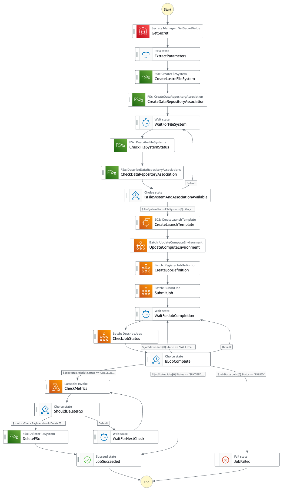

# Lustre Auto Export モード

Lustre Auto Export モードは、AWS BatchとAmazon FSx for Lustreを組み合わせ、S3バケットとの自動同期機能を有効にしたデプロイオプションです。

## 概要

このモードでは、FSx for Lustreファイルシステムが作成され、指定されたS3バケットとの間で自動的にデータの同期が行われます。ファイルシステム上でのファイルの作成、変更、削除は自動的にS3バケットに反映されます。

## アーキテクチャ


Lustre Auto Export モードでは、AWS BatchとFSx for Lustreを組み合わせ、S3バケットとの自動同期機能を活用したアーキテクチャを採用しています。このアーキテクチャでは、Lustreファイルシステム上での変更が自動的にS3バケットに反映され、データの一貫性が保たれます。Step Functionsがワークフローを調整し、CloudWatchメトリクスを監視してエクスポート完了後のリソースクリーンアップを自動化します。

### SPOT インスタンス中断時の動作

SPOT インスタンスが中断された場合でも、Lustreファイルシステム自体は独立して存在し続けるため、データは保持されます。新しいEC2インスタンスが起動する際には、Step Functionによって作成された起動テンプレートを使用して、既存のLustreファイルシステムを自動的にマウントします。これにより中断前の処理状態を引き継いで作業を継続することが可能になります。

<!-- Lustre Auto Export モードでは以下のコンポーネントが連携します：

1. **Amazon FSx for Lustre**: 高性能な共有ファイルシステム
2. **Amazon S3**: データの永続的な保存先
3. **AWS Batch**: コンピューティングジョブの実行
4. **AWS Step Functions**: ワークフローの調整
5. **AWS Lambda**: CloudWatchメトリクスのモニタリング -->

<!-- ## 主な特徴

### 自動エクスポート機能

FSx for Lustreの自動エクスポート機能により、ファイルシステム上での変更が自動的にS3バケットに反映されます：

- **新規ファイル (NEW)**: Lustreファイルシステムに作成された新しいファイルはS3に自動的にアップロード
- **変更ファイル (CHANGED)**: 既存ファイルの変更はS3の対応するオブジェクトに反映
- **削除ファイル (DELETED)**: Lustreから削除されたファイルはS3からも削除

### メトリクスベースの自動クリーンアップ

Lambda関数が定期的にCloudWatchメトリクスをチェックし、エクスポートキューの状態を監視します：

- **AgeOfOldestQueuedMessage**: エクスポートキュー内の最も古いメッセージの経過時間
- すべてのメトリクス値が0になると、エクスポートが完了したと判断
- エクスポート完了後、Step Functionsワークフローが自動的にLustreファイルシステムを削除（オプション） -->

## デプロイパラメータ

パラメータは `cdk.json` ファイルと AWS Secrets Manager の両方で設定できます。`cdk.json` はデプロイ時の初期値を設定し、Secrets Manager はジョブ実行時に値を上書きするために使用できます。

### cdk.json でのみ設定可能なパラメータ

以下のパラメータは `cdk.json` の `autoExport` セクションでのみ変更可能で、インフラストラクチャのデプロイ時に適用されます：

| パラメータ | 説明 | デフォルト値 |
|------------|------|------------|
| envName | 環境名 | "AutoExport" |
| ecrRepositoryName | ECRリポジトリ名 | "batch-job-with-lustre-auto-export" |
| computeEnvironmentType | コンピューティング環境タイプ | "SPOT" |
| computeEnvironmentAllocationStrategy | 割り当て戦略 | "BEST_FIT_PROGRESSIVE" |
| computeEnvironmentInstanceTypes | インスタンスタイプ | ["optimal"] |
| computeEnvironmentMinvCpus | 最小vCPU数 | 0 |
| computeEnvironmentMaxvCpus | 最大vCPU数 | 256 |
| computeEnvironmentDesiredvCpus | 希望vCPU数 | 0 |

### Secrets Manager で変更可能なパラメータ

以下のパラメータは `cdk.json` での初期設定後、Secrets Manager から Step Functions 実行前に変更することも可能です：

| パラメータ | 説明 | デフォルト値 |
|------------|------|------------|
| autoExport | 自動エクスポート機能の有効化 | true |
| deleteLustre | ジョブ完了後のLustre削除フラグ | true |
| lustreFileSystemTypeVersion | Lustreバージョン | "2.15" |
| lustreStorageCapacity | ストレージ容量（GB） | 2400 |
| lustreImportedFileChunkSize | インポートチャンクサイズ（MB） | 1024 |
| jobDefinitionContainerImage | ジョブで使用するコンテナイメージ | ECRリポジトリのイメージURI |
| jobDefinitionRetryAttempts | ジョブ再試行回数 | 5 |
| jobDefinitionVcpus | ジョブあたりのvCPU数 | 32 |
| jobDefinitionMemory | ジョブあたりのメモリ（MB） | 30000 |
| waitForLustreCreationSeconds | Lustre作成待機時間（秒） | 30 |
| waitForJobCompletionSeconds | ジョブ完了待機時間（秒） | 300 |
| waitForCheckMetricsSeconds | メトリクスチェック間隔（秒） | 60 |
| lambdaPeriodSeconds | Lambdaメトリクス取得期間（秒） | 60 |
| lambdaTimeDiffMinutes | Lambdaメトリクス取得時間範囲（分） | 15 |

## Step Functions ワークフロー



Lustre Auto Export モードのStep Functionsワークフローは以下のステップで構成されています：

1. **Secrets Managerからパラメータ取得** (GetSecret → ExtractParameters)
   - 設定パラメータをSecrets Managerから取得し、後続のステップで使用

2. **FSx for Lustreファイルシステム作成** (CreateLustreFileSystem)
   - 指定されたパラメータ（ストレージ容量、バージョンなど）でLustreファイルシステムを作成

3. **S3バケットとのデータリポジトリ関連付け作成** (CreateDataRepositoryAssociation)
   - LustreファイルシステムとS3バケットを関連付け、自動インポート/エクスポート設定を構成

4. **ファイルシステムの可用性確認** (WaitForFileSystem → CheckFileSystemStatus → CheckDataRepositoryAssociation → IsFileSystemAndAssociationAvailable)
   - ファイルシステムとデータリポジトリ関連付けが利用可能になるまで待機
   - 利用可能でない場合は待機を継続

5. **EC2起動テンプレート作成** (CreateLaunchTemplate)
   - Lustreファイルシステムをマウントするためのユーザーデータスクリプトを含む起動テンプレートを作成

6. **Batchコンピューティング環境更新** (UpdateComputeEnvironment)
   - 作成した起動テンプレートを使用するようにBatchコンピューティング環境を更新

7. **ジョブ定義登録** (CreateJobDefinition)
   - Lustreファイルシステムをマウントするコンテナ設定を含むジョブ定義を作成

8. **ジョブ送信** (SubmitJob)
   - 作成したジョブ定義を使用してBatchジョブをキューに送信

9. **ジョブ完了確認** (WaitForJobCompletion → CheckJobStatus → IsJobComplete)
   - ジョブの完了を待機し、ステータスを確認
   - 失敗した場合はエラー処理を実行
   - Host EC2エラーの場合は再試行

10. **CloudWatchメトリクスチェック** (CheckMetrics → ShouldDeleteFSx)
    - AgeOfOldestQueuedMessageメトリクスを確認し、すべてのエクスポートが完了したかを判断
    - 完了していない場合は待機して再チェック

11. **ファイルシステム削除（オプション）** (DeleteFSx)
    - deleteLustreフラグがtrueで、すべてのエクスポートが完了した場合にファイルシステムを削除

このワークフローの特徴は、ジョブ完了後にCloudWatchメトリクスを使用してエクスポートの完了を確認し、すべてのデータがS3に同期された後にのみLustreファイルシステムを削除する点です。これにより、データ損失のリスクを最小限に抑えつつ、不要なリソースを自動的にクリーンアップします。

<!-- ## ユースケース

Lustre Auto Export モードは以下のようなシナリオに適しています：

- **リアルタイムデータ処理**: 処理結果をS3に即時反映する必要がある場合
- **継続的なデータ生成**: 継続的にデータが生成され、S3に保存する必要がある場合
- **自動アーカイブ**: 処理結果を自動的にS3にアーカイブする必要がある場合 -->

## 制限事項と注意点

- **メトリクス取得間隔の設定**: `lambdaTimeDiffMinutes`パラメータを短く設定しすぎると、最終的なデータがS3に同期される前にLustreファイルシステムが削除される恐れがあります。特に大量のデータを処理する場合は、十分な余裕を持った値を設定してください。
- **エクスポート完了の確認**: ファイルシステムを削除する前に、`AgeOfOldestQueuedMessage`メトリクスが0になっていることを確認することが重要です。このメトリクスが0より大きい場合、まだエクスポートされていない変更がS3に反映されていない状態です。
<!-- - **パフォーマンスへの影響**: 自動エクスポート機能はファイルシステムのパフォーマンスに影響を与える可能性があります。 -->
<!-- - **エクスポートキューの遅延**: 大量の小さなファイルの変更は、エクスポートキューの遅延を引き起こす可能性があります。 -->
- **自動クリーンアップの限界**: メトリクスベースの自動クリーンアップは、すべてのエクスポートが完了したことを完全に保証するものではありません。

詳細については、[Amazon FSx for Lustreドキュメント「S3バケットに更新を自動的にエクスポートする」](https://docs.aws.amazon.com/ja_jp/fsx/latest/LustreGuide/autoexport-data-repo-dra.html)を参照してください。

## デプロイ方法

```bash
npx cdk deploy -c type=autoExport
```

## 関連リソース

- [Amazon FSx for Lustre ドキュメント](https://docs.aws.amazon.com/fsx/latest/LustreGuide/what-is.html)
- [AWS Batch ドキュメント](https://docs.aws.amazon.com/batch/latest/userguide/what-is-batch.html)
- [AWS Step Functions ドキュメント](https://docs.aws.amazon.com/step-functions/latest/dg/welcome.html)