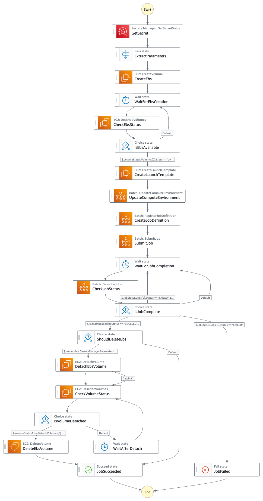

# EBS モード

EBS モードは、AWS BatchとAmazon EBS（Elastic Block Store）を組み合わせたデプロイオプションで、FSx for Lustreを使用せずにシンプルなブロックストレージを提供します。

## 概要

このモードでは、EBSボリューム (gp3) が作成され、Batchジョブを実行するEC2インスタンスにアタッチされます。ジョブ完了後、EBSボリュームはデタッチされ、オプションで削除されます。S3バケットとの連携も可能です。

## アーキテクチャ

EBS モードでは、AWS BatchとAmazon EBSを組み合わせたシンプルで効率的なアーキテクチャを採用しています。このアーキテクチャでは、EBSボリュームがBatchジョブを実行するEC2インスタンスに直接アタッチされ、単一インスタンスでの高速なデータ処理を実現します。


### SPOT インスタンス中断時の動作

SPOT インスタンスが中断された場合、Batchによって起動したEC2にデフォルトであいるEBSは消えてしまいますが、Step Functionによって外部から作成されたEBSボリュームは独立して存在し続けます。新しいEC2インスタンスが起動する際には、Step Functionによって作成された起動テンプレートを使用して、既存のEBSボリュームを自動的にマウントします。これにより中断前の処理状態を引き継いで作業を継続することが可能になります。

<!-- EBS モードでは以下のコンポーネントが連携します：

1. **Amazon EBS**: 高性能なブロックストレージ
2. **Amazon S3**: データの永続的な保存先（オプション）
3. **AWS Batch**: コンピューティングジョブの実行
4. **AWS Step Functions**: ワークフローの調整

## 主な特徴

### EBSボリュームの管理

EBSモードでは、Step Functionsワークフローが以下のEBS関連タスクを実行します：

- **ボリューム作成**: 指定されたサイズ、IOPS、スループットでgp3ボリュームを作成
- **ボリュームアタッチ**: EC2インスタンス起動時にユーザーデータスクリプトを使用してボリュームをアタッチ
- **ボリュームデタッチ**: ジョブ完了後にボリュームをデタッチ
- **ボリューム削除**: オプションでボリュームを削除（deleteEbs=true）

### S3との連携

提供されているDockerコンテナには、EBSボリュームとS3バケットの間でデータを転送するためのスクリプトが含まれています：

- **write_delete_test_ebs_with_s3.sh**: 最後のファイルをS3にコピー
- **write_delete_test_ebs_with_s3_sync.sh**: S3との同期処理を実行 -->

## デプロイパラメータ

パラメータは `cdk.json` ファイルと AWS Secrets Manager の両方で設定できます。`cdk.json` はデプロイ時の初期値を設定し、Secrets Manager はジョブ実行時に値を上書きするために使用できます。

### cdk.json でのみ設定可能なパラメータ

以下のパラメータは `cdk.json` の `onlyEBS` セクションでのみ変更可能で、インフラストラクチャのデプロイ時に適用されます：

| パラメータ | 説明 | デフォルト値 |
|------------|------|------------|
| envName | 環境名 | "OnlyEBS" |
| ecrRepositoryName | ECRリポジトリ名 | "batch-job-with-ebs" |
| computeEnvironmentType | コンピューティング環境タイプ | "SPOT" |
| computeEnvironmentAllocationStrategy | 割り当て戦略 | "BEST_FIT_PROGRESSIVE" |
| computeEnvironmentInstanceTypes | インスタンスタイプ | ["optimal"] |
| computeEnvironmentMinvCpus | 最小vCPU数 | 0 |
| computeEnvironmentMaxvCpus | 最大vCPU数 | 256 |
| computeEnvironmentDesiredvCpus | 希望vCPU数 | 0 |

### Secrets Manager で変更可能なパラメータ

以下のパラメータは `cdk.json` での初期設定後、Secrets Manager から Step Functions 実行前に変更することも可能です：

| パラメータ | 説明 | デフォルト値 |
|------------|------|------------|
| deleteEbs | ジョブ完了後のEBS削除フラグ | true |
| ebsSizeGb | EBSボリュームサイズ（GB） | 500 |
| ebsIOPS | EBSのIOPS | 5000 |
| ebsThroughput | EBSのスループット（MB/s） | 500 |
| jobDefinitionContainerImage | ジョブで使用するコンテナイメージ | ECR のコンテナイメージ URI |
| jobDefinitionRetryAttempts | ジョブ再試行回数 | 5 |
| jobDefinitionVcpus | ジョブあたりのvCPU数 | 32 |
| jobDefinitionMemory | ジョブあたりのメモリ（MB） | 30000 |
| waitForEbsCreationSeconds | EBS作成待機時間（秒） | 30 |
| waitForJobCompletionSeconds | ジョブ完了待機時間（秒） | 300 |
| waitAfterDetachSeconds | デタッチ後の待機時間（秒） | 10 |

## Step Functions ワークフロー



EBS モードのStep Functionsワークフローは以下のステップで構成されています：

1. **Secrets Managerからパラメータ取得** (GetSecret → ExtractParameters)
   - 設定パラメータをSecrets Managerから取得し、後続のステップで使用

2. **EBSボリューム作成** (CreateEbs)
   - 指定されたパラメータ（サイズ、IOPS、スループットなど）でEBSボリュームを作成
   - gp3タイプのボリュームを使用

3. **ボリュームの可用性確認** (WaitForEbsCreation → CheckEbsStatus → IsEbsAvailable)
   - EBSボリュームが利用可能になるまで待機
   - 利用可能でない場合は待機を継続

4. **EC2起動テンプレート作成** (CreateLaunchTemplate)
   - EBSボリュームをアタッチするためのユーザーデータスクリプトを含む起動テンプレートを作成
   - スクリプトには、ボリュームのマウント、フォーマット（必要な場合）、使用中チェックなどの処理が含まれる

5. **Batchコンピューティング環境更新** (UpdateComputeEnvironment)
   - 作成した起動テンプレートを使用するようにBatchコンピューティング環境を更新

6. **ジョブ定義登録** (CreateJobDefinition)
   - EBSボリュームをマウントするコンテナ設定を含むジョブ定義を作成
   - /dataディレクトリをコンテナにマウント

7. **ジョブ送信** (SubmitJob)
   - 作成したジョブ定義を使用してBatchジョブをキューに送信

8. **ジョブ完了確認** (WaitForJobCompletion → CheckJobStatus → IsJobComplete)
   - ジョブの完了を待機し、ステータスを確認
   - 失敗した場合はエラー処理を実行
   - Host EC2エラーの場合は再試行

9. **EBSボリュームデタッチ（deleteEbs=trueの場合）** (DetachEbsVolume)
   - deleteEbsフラグがtrueの場合、ボリュームをインスタンスからデタッチ
   - エラーが発生しても処理を継続（addCatch設定）

10. **EBSボリューム削除（deleteEbs=trueの場合）** (WaitAfterDetach → DeleteEbsVolume)
    - デタッチ後に短時間待機してからボリュームを削除
    - deleteEbsフラグがfalseの場合はこのステップをスキップし、ボリュームを保持

<!-- このワークフローの特徴は、Lustreモードと比較してシンプルな構造であることです。単一のEBSボリュームを作成し、Batchジョブで使用した後、オプションでクリーンアップするという直接的なフローになっています。また、ボリュームが使用中の場合（他のインスタンスにアタッチされている場合）は、ユーザーデータスクリプトによってインスタンスを自動的に終了させる安全機構が組み込まれています。 -->

<!-- ## Lustre モードとの違い

| 機能 | EBS モード | Lustre モード |
|------|----------------|--------------|
| ストレージタイプ | ブロックストレージ | 共有ファイルシステム |
| 複数インスタンスからのアクセス | 不可 | 可能 |
| S3との統合 | 手動/スクリプト | ネイティブ |
| パフォーマンス | 単一インスタンス向け最適化 | 分散処理向け最適化 |
| コスト | 比較的低コスト | 比較的高コスト |
| セットアップの複雑さ | シンプル | 複雑 | -->

<!-- ## テストスクリプト

EBS モードには、EBSボリュームのパフォーマンスをテストするための複数のスクリプトが含まれています：

### write_delete_test_ebs_v2.sh

基本的なEBSパフォーマンステスト：

- 指定サイズのファイルを書き込み
- 前のファイルを削除
- パフォーマンスメトリクスを収集

### write_delete_test_ebs_with_s3.sh

EBSとS3の連携テスト：

- 指定サイズのファイルを書き込み
- 前のファイルを削除
- 最後のファイルをS3にコピー

### write_delete_test_ebs_with_s3_sync.sh

EBSとS3の同期テスト：

- S3から前のファイルをダウンロード
- 新しいファイルを書き込み
- ファイルをS3にアップロード
- ローカルファイルを削除 -->

<!-- ## ユースケース

EBS モードは以下のようなシナリオに適しています：

- **単一インスタンス処理**: 共有ファイルシステムが不要な場合
- **コスト最適化**: FSx for Lustreよりも低コストでストレージが必要な場合
- **シンプルなワークロード**: 複雑なファイルシステム機能が不要な場合
- **高IOPSワークロード**: 高いIOPSとスループットが必要な場合 -->

## 制限事項と注意点

- **シングルノード限定**: EBSボリューム(gp3)は一度に1つのEC2インスタンスにしかアタッチできないため、シングルノードのタスクでしか利用できません。複数ノードでの並列処理が必要な場合はLustreモードを検討してください。
- **単一AZの制約**: このモードでは単一のアベイラビリティゾーンを使用するため、SPOTインスタンスを使用する場合、インスタンスが確保しにくくなる可能性があります。これにより、ジョブの開始が遅れたり、SPOTインスタンスの価格が上昇する可能性があります。
- **S3連携の制限**: S3との統合は手動またはスクリプトを通じて行う必要があり、Lustreモードのような自動同期機能はありません。
- **排他的アクセス**: ボリュームがアタッチされている間は、そのコンピューティング環境で他のジョブを起動できません。

## デプロイ方法

```bash
npx cdk deploy -c type=onlyEBS
```

<!-- ## 関連リソース

- [Amazon EBS ドキュメント](https://docs.aws.amazon.com/AWSEC2/latest/UserGuide/AmazonEBS.html)
- [AWS Batch ドキュメント](https://docs.aws.amazon.com/batch/latest/userguide/what-is-batch.html)
- [AWS Step Functions ドキュメント](https://docs.aws.amazon.com/step-functions/latest/dg/welcome.html) -->