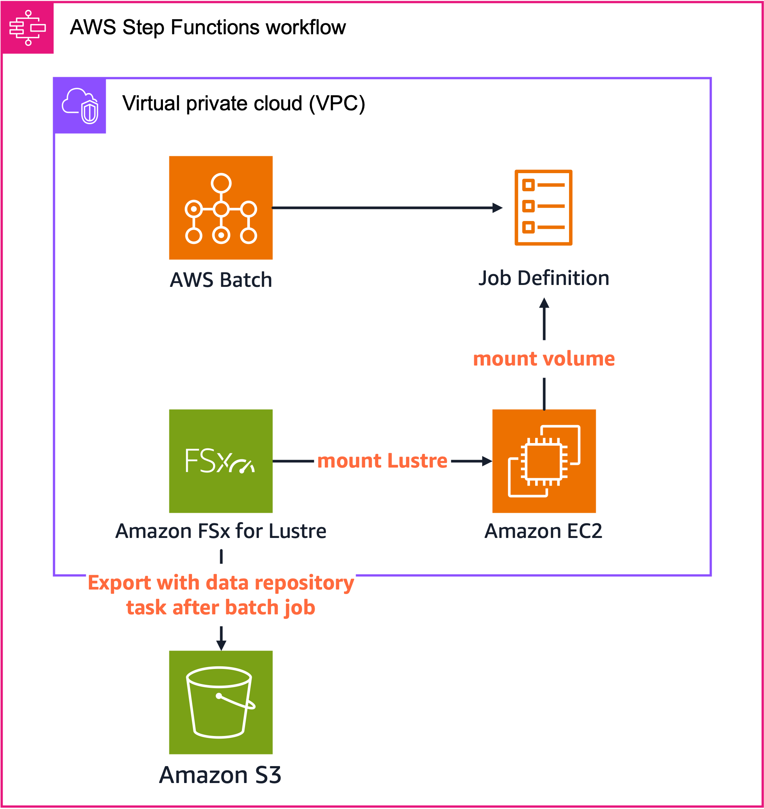
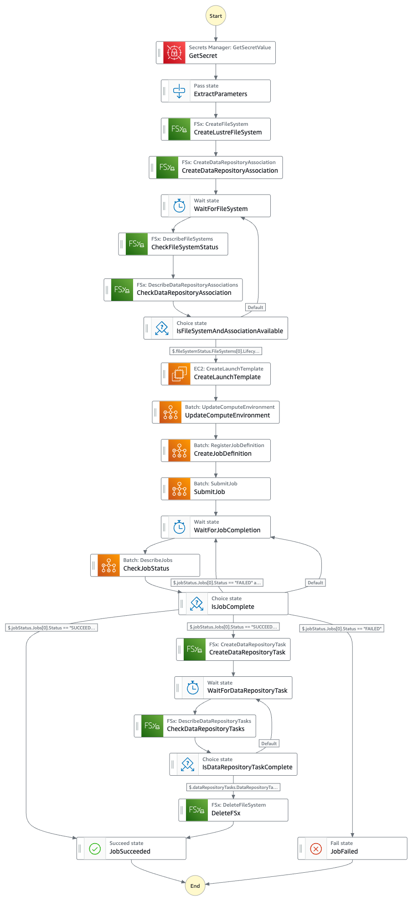

# Lustre Task Export モード

Lustre Task Export モードは、AWS BatchとAmazon FSx for Lustreを組み合わせ、明示的なデータリポジトリタスクを使用してS3バケットにデータをエクスポートするデプロイオプションです。

## 概要

このモードでは、FSx for Lustreファイルシステムが作成され、指定されたS3バケットからデータを自動的にインポートします。ただし、S3へのエクスポートは自動的には行われず、ジョブ完了後に明示的なデータリポジトリタスク（EXPORT_TO_REPOSITORY）を実行してデータをS3にエクスポートします。

## アーキテクチャ



Lustre Task Export モードでは、AWS BatchとFSx for Lustreを組み合わせ、明示的なデータリポジトリタスクを使用したアーキテクチャを採用しています。このアーキテクチャでは、S3からLustreへのデータインポートは自動的に行われますが、Lustreから S3へのエクスポートはジョブ完了後に明示的なタスクとして実行されます。これにより、ジョブ実行中のオーバーヘッドを抑えつつ、処理結果を確実にS3に保存することができます。

Lustre Task Export モードでは以下のコンポーネントが連携します：

1. **Amazon FSx for Lustre**: 高性能な共有ファイルシステム
2. **Amazon S3**: データの永続的な保存先
3. **AWS Batch**: コンピューティングジョブの実行
4. **AWS Step Functions**: ワークフローの調整
5. **FSx データリポジトリタスク**: 明示的なエクスポート処理

## 主な特徴

### 明示的なエクスポート機能

Lustre Auto Exportモードとは異なり、Lustre Task Exportモードではファイルシステム上での変更は自動的にS3に反映されません。代わりに、ジョブ完了後に明示的なデータリポジトリタスクを実行してデータをエクスポートします：

- **EXPORT_TO_REPOSITORY**: 指定したパス（/scratch）のデータをS3バケットにエクスポート
- エクスポートタスクの完了を待機してから、ファイルシステムを削除（オプション）

**重要な注意点**: Batchジョブの実行中に作成または変更されたファイルは、ジョブ実行中にはS3に自動的に同期されません。これらのファイルは、Batchジョブが完了した後に、Step Functionsワークフローによって明示的に作成される[データリポジトリタスク](https://docs.aws.amazon.com/ja_jp/fsx/latest/LustreGuide/data-repository-tasks.html)によってS3にエクスポートされます。このため、ジョブ実行中にS3からデータにアクセスする必要がある場合は、別の方法（例：S3へのダイレクトアップロード）を検討する必要があります。

### 自動インポート機能

S3からLustreへの自動インポートは引き続き有効です：

- **新規ファイル (NEW)**: S3に追加された新しいファイルはLustreに自動的にインポート
- **変更ファイル (CHANGED)**: S3で変更されたファイルはLustreに反映
- **削除ファイル (DELETED)**: S3から削除されたファイルはLustreからも削除

## デプロイパラメータ

パラメータは `cdk.json` ファイルと AWS Secrets Manager の両方で設定できます。`cdk.json` はデプロイ時の初期値を設定し、Secrets Manager はジョブ実行時に値を上書きするために使用できます。

### cdk.json でのみ変更可能なパラメータ

以下のパラメータは `cdk.json` の `taskExport` セクションでのみ変更可能で、インフラストラクチャのデプロイ時に適用されます：

| パラメータ | 説明 | デフォルト値 |
|------------|------|------------|
| envName | 環境名 | "TaskExport" |
| ecrRepositoryName | ECRリポジトリ名 | "batch-job-with-lustre-task-export" |
| computeEnvironmentType | コンピューティング環境タイプ | "SPOT" |
| computeEnvironmentAllocationStrategy | 割り当て戦略 | "BEST_FIT_PROGRESSIVE" |
| computeEnvironmentInstanceTypes | インスタンスタイプ | ["optimal"] |
| computeEnvironmentMinvCpus | 最小vCPU数 | 0 |
| computeEnvironmentMaxvCpus | 最大vCPU数 | 256 |
| computeEnvironmentDesiredvCpus | 希望vCPU数 | 0 |

### cdk.json と Secrets Manager の両方で変更可能なパラメータ

以下のパラメータは `cdk.json` での初期設定後、Secrets Manager で実行時に変更することも可能です：

| パラメータ | 説明 | デフォルト値 |
|------------|------|------------|
| autoExport | 自動エクスポート機能の有効化 | false |
| deleteLustre | ジョブ完了後のLustre削除フラグ | true |
| lustreFileSystemTypeVersion | Lustreバージョン | "2.15" |
| lustreStorageCapacity | ストレージ容量（GB） | 2400 |
| lustreImportedFileChunkSize | インポートチャンクサイズ（MB） | 1024 |
| jobDefinitionRetryAttempts | ジョブ再試行回数 | 5 |
| jobDefinitionVcpus | ジョブあたりのvCPU数 | 32 |
| jobDefinitionMemory | ジョブあたりのメモリ（MB） | 30000 |
| waitForLustreCreationSeconds | Lustre作成待機時間（秒） | 30 |
| waitForJobCompletionSeconds | ジョブ完了待機時間（秒） | 300 |
| waitForDataRepositoryTaskSeconds | データリポジトリタスク待機時間（秒） | 300 |

## Step Functions ワークフロー



Lustre Task Export モードのStep Functionsワークフローは以下のステップで構成されています：

1. **Secrets Managerからパラメータ取得** (GetSecret → ExtractParameters)
   - 設定パラメータをSecrets Managerから取得し、後続のステップで使用

2. **FSx for Lustreファイルシステム作成** (CreateLustreFileSystem)
   - 指定されたパラメータでLustreファイルシステムを作成
   - Auto Exportモードとは異なり、自動エクスポート機能は無効

3. **S3バケットとのデータリポジトリ関連付け作成** (CreateDataRepositoryAssociation)
   - LustreファイルシステムとS3バケットを関連付け、自動インポートのみを設定

4. **ファイルシステムの可用性確認** (WaitForFileSystem → CheckFileSystemStatus → CheckDataRepositoryAssociation → IsFileSystemAndAssociationAvailable)
   - ファイルシステムとデータリポジトリ関連付けが利用可能になるまで待機
   - 利用可能でない場合は待機を継続

5. **EC2起動テンプレート作成** (CreateLaunchTemplate)
   - Lustreファイルシステムをマウントするためのユーザーデータスクリプトを含む起動テンプレートを作成

6. **Batchコンピューティング環境更新** (UpdateComputeEnvironment)
   - 作成した起動テンプレートを使用するようにBatchコンピューティング環境を更新

7. **ジョブ定義登録** (CreateJobDefinition)
   - Lustreファイルシステムをマウントするコンテナ設定を含むジョブ定義を作成

8. **ジョブ送信** (SubmitJob)
   - 作成したジョブ定義を使用してBatchジョブをキューに送信

9. **ジョブ完了確認** (WaitForJobCompletion → CheckJobStatus → IsJobComplete)
   - ジョブの完了を待機し、ステータスを確認
   - 失敗した場合はエラー処理を実行
   - Host EC2エラーの場合は再試行

10. **データリポジトリタスク作成（EXPORT_TO_REPOSITORY）** (CreateDataRepositoryTask)
    - ジョブが成功した場合、明示的なエクスポートタスクを作成
    - 指定したパス（/scratch）のデータをS3バケットにエクスポート

11. **データリポジトリタスク完了確認** (WaitForDataRepositoryTask → CheckDataRepositoryTasks → IsDataRepositoryTaskComplete)
    - エクスポートタスクの完了を待機し、ステータスを確認
    - 完了していない場合は待機を継続

12. **ファイルシステム削除（オプション）** (DeleteFSx)
    - deleteLustreフラグがtrueで、エクスポートタスクが完了した場合にファイルシステムを削除

このワークフローの特徴は、Lustre Auto Exportモードとは異なり、ジョブ完了後に明示的なデータリポジトリタスクを作成してS3へのエクスポートを行う点です。これにより、ジョブ実行中はエクスポート処理によるオーバーヘッドを避けつつ、ジョブ完了後に確実にデータをS3に保存することができます。また、エクスポートタスクの完了を確認してからファイルシステムを削除するため、データ損失のリスクを最小限に抑えることができます。

## Lustre Auto Export モードとの違い

| 機能 | Lustre Task Export モード | Lustre Auto Export モード |
|------|-------------------|-------------------|
| S3からのインポート | 自動 | 自動 |
| S3へのエクスポート | 明示的なタスク実行 | 自動 |
| クリーンアップトリガー | データリポジトリタスク完了 | CloudWatchメトリクス |
| ユースケース | バッチ処理、大規模データセット | リアルタイム処理、継続的データ生成 |

## ユースケース

Lustre Task Export モードは以下のようなシナリオに適しています：

- **バッチ処理**: 処理完了後に一括でデータをエクスポートする場合
- **大規模データセット**: 大量のデータを処理し、処理完了後にまとめてエクスポートする場合
- **制御されたエクスポート**: エクスポートのタイミングを明示的に制御したい場合

## 制限事項

- エクスポートタスクの実行中はファイルシステムのパフォーマンスに影響を与える可能性があります
- 大量のファイルをエクスポートする場合、エクスポートタスクの完了に時間がかかる場合があります
- エクスポートタスクが失敗した場合、手動での介入が必要になる場合があります

## デプロイ方法

```bash
npx cdk deploy -c type=taskExport
```

## 関連リソース

- [Amazon FSx for Lustre データリポジトリタスク](https://docs.aws.amazon.com/fsx/latest/LustreGuide/data-repository-tasks.html)
- [AWS Batch ドキュメント](https://docs.aws.amazon.com/batch/latest/userguide/what-is-batch.html)
- [AWS Step Functions ドキュメント](https://docs.aws.amazon.com/step-functions/latest/dg/welcome.html)